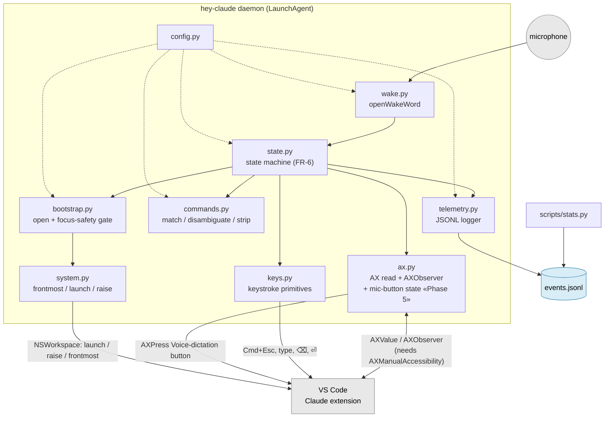
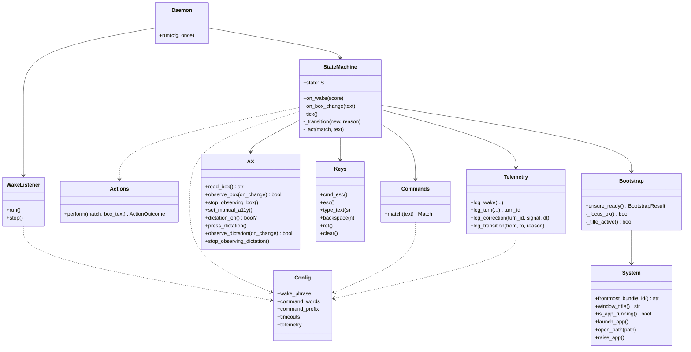
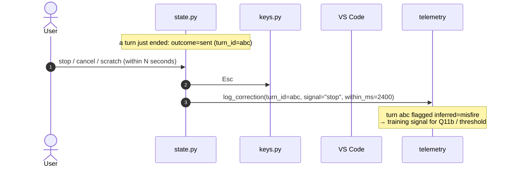
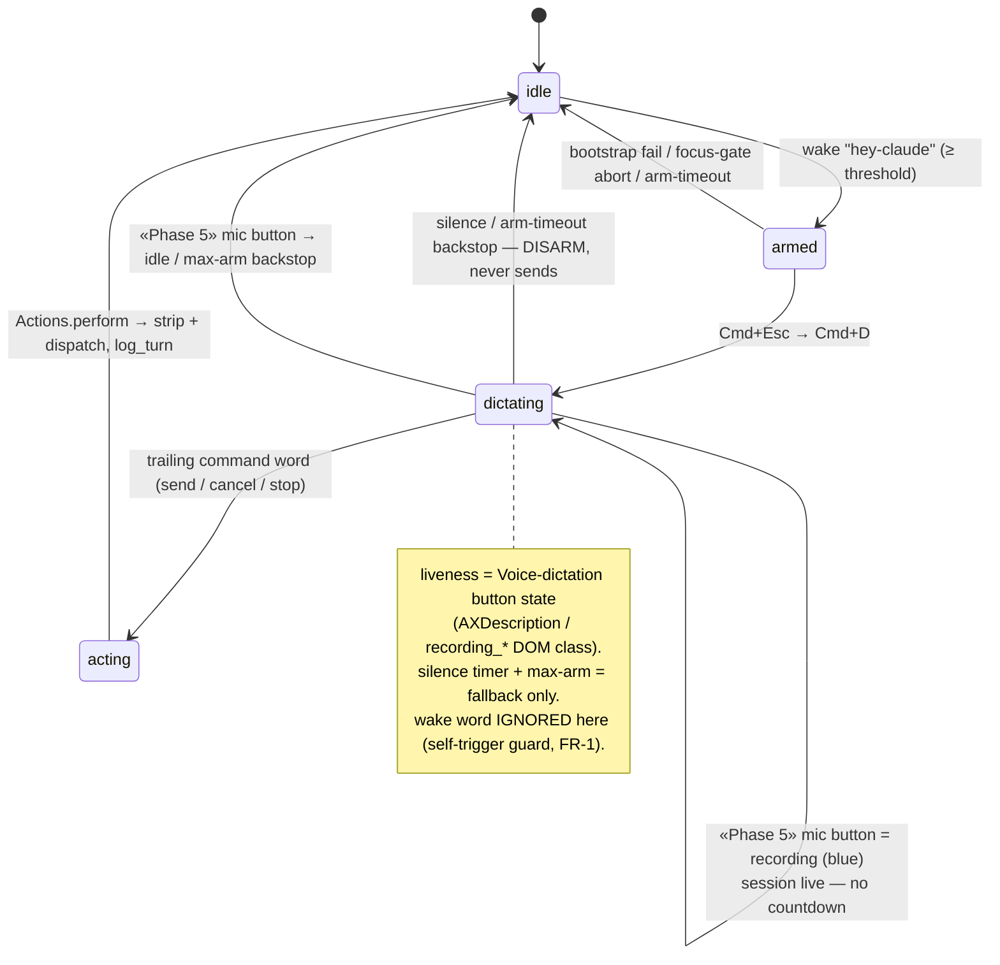
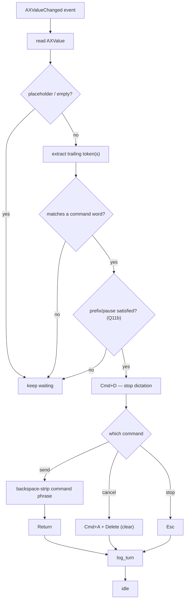
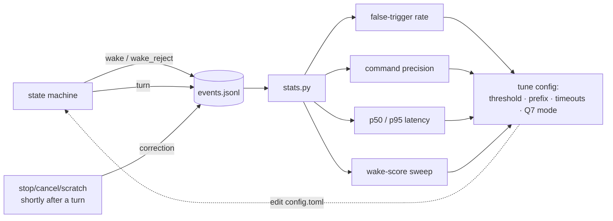
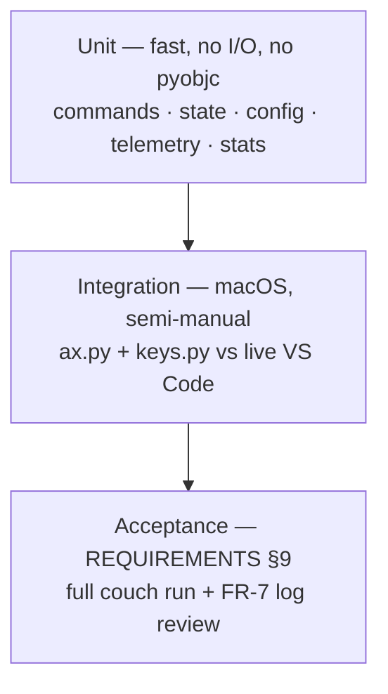

# hey-claude — Architecture & Design

Diagrams and the concrete data model behind [`REQUIREMENTS.md`](REQUIREMENTS.md) /
[`BUILD-PLAN.md`](BUILD-PLAN.md). Unmarked elements are **built and verified**
(2026-07-06 tests). Elements tagged **«Phase N»** are *target state* from the
[`HARDENING-PLAN.md`](HARDENING-PLAN.md) — designed, not yet built — so every
diagram box/edge maps to either current code or a named phase.
Diagrams are Mermaid (render in VS Code with the Mermaid extension, and on GitHub).

---

## 1. Component diagram



`ax.py`, `keys.py`, and `system.py` are the only modules that touch VS Code —
everything else is pure logic, which keeps the state machine and command logic
unit-testable without a running editor. The keystroke/AX dispatch lives in
`actions.py` (Phase 2, built); `state.py` sequences turns and delegates to it.

---

## 2. Class diagram (UML)



**Not yet built** (target state — see [`HARDENING-PLAN.md`](HARDENING-PLAN.md)):
- `AX.read_button_state` — **Phase 5** (mic-button liveness signal).
- `AX.reregister_on_focus` — **Phase 3** (stale-AX-ref recovery).
- `StateMachine.tick()` today runs only the **backstop timeouts** (arm/silence); the
  liveness gate it will drive is **Phase 5**.

**Built:** `StateMachine._transition` + `Telemetry.log_transition` (Phase 1);
`class Actions` + `StateMachine..>Actions` — the keystroke/AX choreography now lives in
`actions.py` (`Actions.perform`), delegated from `StateMachine._act` (Phase 2).

---

## 3. Runtime sequence — happy path (one turn)

```mermaid
sequenceDiagram
  autonumber
  actor U as User
  participant W as wake.py
  participant SM as state.py
  participant BS as bootstrap.py
  participant AX as ax.py
  participant K as keys.py
  participant VS as VS Code
  participant T as telemetry

  U->>W: say "hey-claude"
  W->>SM: on_wake(score=0.72)
  SM->>T: log_wake(accepted, score)
  Note over SM: idle → armed
  SM->>BS: ensure_ready()
  BS->>VS: system.py: launch / open / raise
  BS->>BS: _focus_ok()? bundle+title
  SM->>K: Cmd+Esc (focus Claude input)
  SM->>AX: dictation_on()? + observe_dictation(on_change)
  SM->>AX: press_dictation() (AXPress the button)
  Note over SM: still armed — awaiting the button-on event
  AX->>VS: AXObserver(AXTitleChanged) on the button
  VS-->>AX: title → "Stop recording" (blue)
  AX-->>SM: on_dictation_change(is_on=True)
  Note over SM: armed → dictating (ground truth; wake now ignored)
  SM->>AX: observe_box(on_change)
  AX->>VS: AXObserver(AXValueChanged)
  U->>VS: "add retry loop. okay send"
  loop each transcription chunk
    VS-->>AX: value changed
    AX-->>SM: on_box_change(text)
    SM->>SM: trailing token a command? prefix ok?
  end
  Note over SM: OR button turns off (OS/user) → on_dictation_change(False) → DISARM (dropped beep, never sends)
  Note over SM: "okay send" matched → dictating → acting → Actions.perform
  SM->>AX: press_dictation() (stop dictation)
  SM->>K: backspace × len("okay send")
  SM->>K: Return
  SM->>T: log_turn(sent, latency, pre/post-strip)
  Note over SM: acting → idle (dispatch lives in actions.py, Phase 2)
```

## 3a. Runtime sequence — cancel / mis-fire (implicit feedback)



---

## 4. State machine (FR-6)

**Liveness signal (BUILT 2026-07-06 — see DICTATION-AX-PLAN.md):** while `dictating`,
VS Code's own **Voice-dictation button** is the ground truth. Its `AXDescription` flips
`Voice dictation` ⇄ `Stop recording` (a `recording_*` DOM class appears) and it emits
**`AXTitleChanged`** on every toggle, so a second `AXObserver` on it drives the DICTATING
edges event-driven — no polling. `armed → dictating` fires only on a button-on event;
`dictating → idle` fires on a button-off event (OS/user turning the mic off → the "dropped"
beep, never sends). There is **no silence/disarm timer** — a thinking pause keeps the button
blue and the turn alive. The only `tick()` timeout left is the `arm_s` backstop (the button
never turned on after the AXPress). The `acting` state is **built** (Phase 2): a command
match routes `dictating → acting → idle`, with `Actions.perform` doing the dispatch.



---

## 5. Command processing (flowchart)



The `STOP → dispatch → log_turn` subgraph lives in `actions.py` (`Actions.perform`,
Phase 2), invoked from `StateMachine._act` once the machine is in `acting`; the flow
itself is unchanged, only its home module.

---

## 6. Telemetry & tuning (detailed)

The point of telemetry is a **closed loop**: real sessions produce events → `stats.py`
derives metrics → metrics tune config (threshold, prefix, timeouts) → better behavior.
This is what makes the heuristics battle-tested instead of guessed.

### 6.1 Data flow



### 6.2 Record types (append-only JSONL, one object per line)

Three event types share a common envelope. `schema` lets us evolve the format.

**Common envelope**
| field | type | notes |
|---|---|---|
| `schema` | int | format version (start `1`) |
| `ts` | string | ISO-8601 UTC, ms precision |
| `event` | enum | `wake` \| `turn` \| `correction` \| `state_transition` |
| `session_id` | string | per daemon start (groups a couch session) |

**`wake`** — every wake decision, *including near-misses & false accepts*
```json
{ "schema":1, "ts":"2026-07-06T21:03:10.101Z", "event":"wake", "session_id":"s_8f2",
  "score":0.72, "threshold":0.50, "accepted":true,
  "followed_through":true }        // false ⇒ armed then arm-timeout = false accept
```
Near-misses (below trigger but above a `log_floor`) are logged with
`accepted:false` so the score distribution is complete for threshold tuning.

**`turn`** — one completed (or aborted) interaction
```json
{ "schema":1, "ts":"2026-07-06T21:03:16.842Z", "event":"turn", "session_id":"s_8f2",
  "turn_id":"t_abc",
  "warm":true,
  "bootstrap":{ "cold_start":false, "ms":38, "focus_gate":"pass" },
  "dictation":{ "sentence_done":"trailing_word", "chars":84, "ms":6210 },
  "command":{ "matched":"send", "prefix":"okay",
              "box_pre_strip":"add retry loop okay send",
              "box_post_strip":"add retry loop", "strip_chars":10 },
  "outcome":"sent",                // sent | cancelled | stopped | timeout | error
  "latency_ms":{ "wake_to_action":780 },
  "errors":[] }
```

**`correction`** — implicit feedback, emitted async, linked by `turn_id`
```json
{ "schema":1, "ts":"2026-07-06T21:03:19.242Z", "event":"correction", "session_id":"s_8f2",
  "turn_id":"t_abc", "signal":"stop", "within_ms":2400, "inferred":"misfire" }
```
Rule: a `stop`/`cancel`/`scratch` (or an immediate re-`hey-claude` redo) within
`correction_window_ms` of a `sent` turn ⇒ that turn was probably a mistake.

**`state_transition`** — every `IDLE`/`ARMED`/`DICTATING` change, emitted by the single
`_transition` chokepoint (HARDENING-PLAN Phase 1). `illegal:true` flags a transition not
in the declared legal table (a bug); in test builds it also raises.
```json
{ "schema":1, "ts":"2026-07-06T21:03:10.140Z", "event":"state_transition", "session_id":"s_8f2",
  "from":"armed", "to":"dictating", "reason":"dictation_started", "mono":1234.56, "illegal":false }
```
This is the state-trace the tuning loop previously lacked — arm/disarm/dispatch timing
and any illegal transition are now visible per session.

### 6.3 Redaction (`store_prompt_text`)
`box_pre_strip` / `box_post_strip` are the only sensitive fields. The config knob
transforms them at write time:
| value | stored as |
|---|---|
| `full` | verbatim text |
| `hash` | `sha256(text)[:12]` (dedupe/repeat detection, not readable) |
| `length_only` | `{"len": 24}` |
| `off` | field omitted |
Audio is **never** written under any setting (NFR-1).

### 6.4 Retention & rotation
- One file per day: `~/Library/Logs/hey-claude/events-YYYY-MM-DD.jsonl`.
- Delete files older than `retention_days` on startup.
- Append-only; never rewritten (corrections are new lines, joined at analysis time).

### 6.5 Metrics (`scripts/stats.py`)
| metric | definition | tunes |
|---|---|---|
| **false-trigger rate** | `wake{accepted,!followed_through}` ÷ all `accepted` wakes | wake `threshold` |
| **wake-score sweep** | histogram of scores split by `followed_through` | optimal `threshold` |
| **command precision** | `1 − (misfired sends ÷ sends)`, misfire via `correction` | `command_prefix`, Q11b |
| **latency p50/p95** | `wake_to_action` over `warm` turns | perf regressions (NFR-4) |
| **cold-start rate/ms** | share of turns with `cold_start:true` + their ms | UX expectation |
| **disarm rate** | `dictating → idle` silence timeouts ÷ arms | arm/silence timeouts |
| **strip integrity** | sends whose `correction.within_ms` is tiny | strip/disambiguation bugs |

### 6.6 The tuning loop in practice
After ~a week of couch use: run `stats.py`. If false-trigger rate is high →
raise `threshold` (the sweep shows where). If command precision is low → the
`box_pre_strip` of misfired turns shows *why* (e.g. prompts ending in "send") →
tighten `command_prefix` or switch Q11b to pause-delimited, or fall back to
Option B. Every knob has a metric that points at it.

---

## 7. Testing strategy

### 7.1 What makes it testable
The correctness-critical logic (command match/strip, state transitions, telemetry)
is **pure** — it never calls pyobjc or presses a key. That's enforced by a design
rule: `state.py` and `commands.py` depend on **ports** (protocols) `AXPort` /
`KeysPort`, not on `ax.py` / `keys.py` directly. Tests inject `FakeAX`
(scriptable box-value sequence) and `FakeKeys` (records the ops emitted). So the
unit path **never imports pyobjc** — it runs anywhere, fast, in CI.



### 7.2 Unit targets
| module | test focus | how |
|---|---|---|
| `commands.py` | trailing-token match, prefix/pause disambiguation, `strip_len` | golden table (7.3) |
| `state.py` | transitions, timeouts, self-trigger guard, never-auto-send | event-sequence table + fake clock |
| `telemetry.py` | record shape, redaction modes, correction-window linking | assert emitted dicts |
| `config.py` | defaults, validation, bad-value handling | parametrized |
| `stats.py` | metric math over fixture JSONL | golden fixtures |
| `bootstrap.py` | focus-safety gate decision | fake frontmost bundle/title |
| `wake.py` | threshold + debounce over a synthetic score stream | fake scores |

### 7.3 Golden table — command match + strip (highest-value tests)
The riskiest logic; enumerate the traps explicitly.

| box text (dictated) | `command_prefix` | → matched | strip_chars | post-strip | why |
|---|---|---|---|---|---|
| `add retry loop okay send` | `okay` | `send` | 10 | `add retry loop` | prefix present |
| `add retry loop send` | `okay` | — | — | — | no prefix ⇒ **not** a command |
| `remind me to send the invoice` | `okay` | — | — | — | "send" mid-sentence, no prefix |
| `fix the bug okay cancel` | `okay` | `cancel` | — | *(clear)* | cancel path |
| `okay stop` | `okay` | `stop` | — | — | stop path |
| `add retry loop send` | `""` | `send` | 5 | `add retry loop` | bare-trailing-word mode |
| `remind me to send the invoice` | `""` | — | — | — | "send" not the final token |
| `Queue another message…` | any | — | — | — | placeholder ⇒ empty |
| `` (empty) | any | — | — | — | empty box |
| `Send.` / `SEND` | `""` | `send` | — | — | case/punct-insensitive final token |

```python
# tests/test_commands.py  (illustrative)
import pytest
from hey_claude.commands import Commands

@pytest.mark.parametrize("text,prefix,cmd,post", [
    ("add retry loop okay send", "okay", "send", "add retry loop"),
    ("add retry loop send",      "okay", None,   None),
    ("remind me to send the invoice", "okay", None, None),
])
def test_match_and_strip(text, prefix, cmd, post):
    c = Commands(prefix=prefix, words={"send":["send","okay send"]})
    m = c.match(text)
    assert (m.command if m else None) == cmd
    if cmd == "send":
        assert text[:len(text)-c.strip_len(text, m)].rstrip() == post
```

### 7.4 State-machine table tests (fake clock, fake ports)
Feed an event sequence, assert the state trajectory **and** the ops emitted to
`FakeKeys`:
- `[wake(0.7)]` → `armed`, bootstrap invoked.
- `[wake, box("hi okay send")]` → `idle` (via transient `acting`); FakeKeys ops =
  `[Cmd+D, ⌫×N, Return]`; transitions include `dictating→acting→idle`.
- `[wake, wake]` (2nd during dictating) → still `dictating` (**self-trigger ignored**).
- `[wake, tick(> silence_timeout)]` → `idle`, **no Return emitted** (never auto-sends).
- `[wake, box("… okay cancel")]` → `idle`; ops include `Cmd+A,Delete`, **no Return**.

### 7.5 Telemetry tests
- Redaction: `store_prompt_text=hash` ⇒ field is 12-hex; `off` ⇒ field absent;
  `length_only` ⇒ `{"len":N}`.
- Correction: `stop` at `within_ms < window` ⇒ `correction{inferred:"misfire"}`;
  at `> window` ⇒ **no** correction.
- `stats.py`: fixture of 10 accepted wakes, 2 not-followed-through ⇒
  false-trigger rate `0.2`; p50/p95 over known latencies.

### 7.6 Integration tier (macOS, semi-manual)
The already-written probes are the seeds: the `AXObserver` test and the
type→backspace→read test become `tests/integration/` smoke tests, marked
`@pytest.mark.integration` and **skipped by default** (need a live focused VS Code
box). Run locally before a release; they assert the AX layer still reads and the
keymap still lands.

### 7.7 Tooling & CI
- **pytest** with markers: `unit` (default), `integration`, `manual`.
- **Fake clock** (inject a `now()` callable) for timeout tests — no real sleeps.
- `tmp_path` fixtures for JSONL round-trips.
- CI (even just a local pre-push hook) runs `pytest -m unit` — green without a
  Mac GUI because the unit path never imports pyobjc (7.1). Integration/manual are
  developer-run.
- Per-milestone: **M1** lands the `commands` + `state` unit suites alongside the
  walking skeleton; each later milestone adds its module's tests before wiring.
