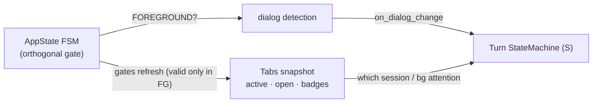
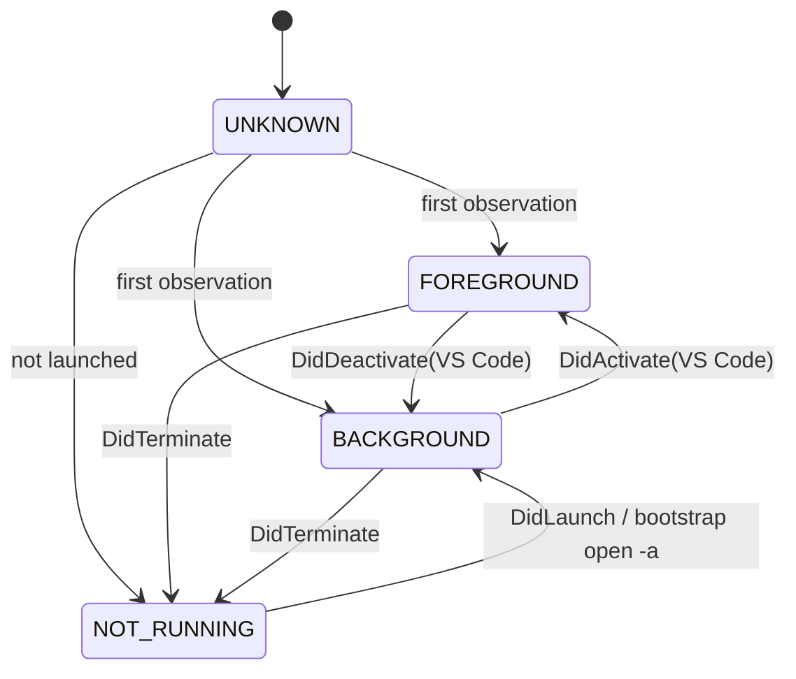
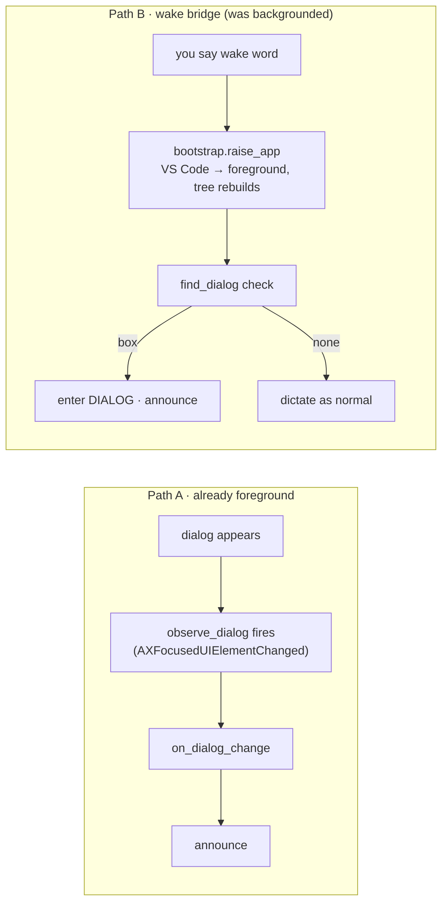
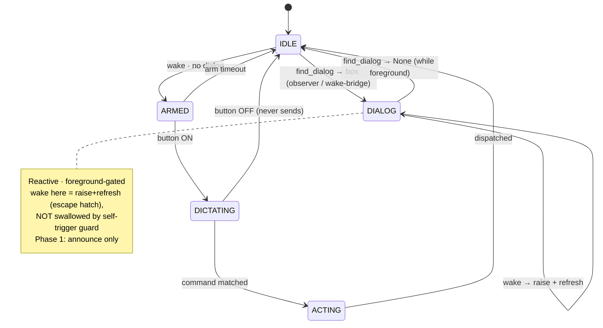
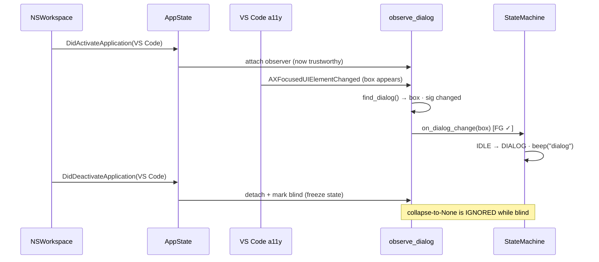
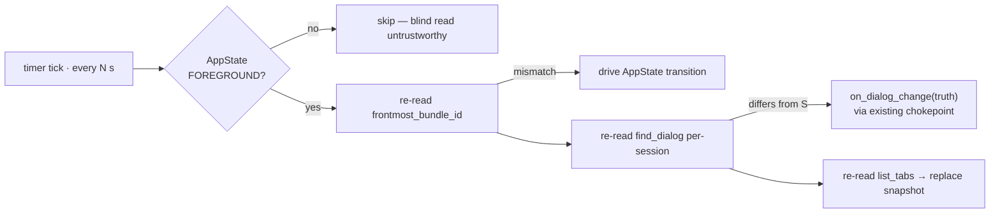
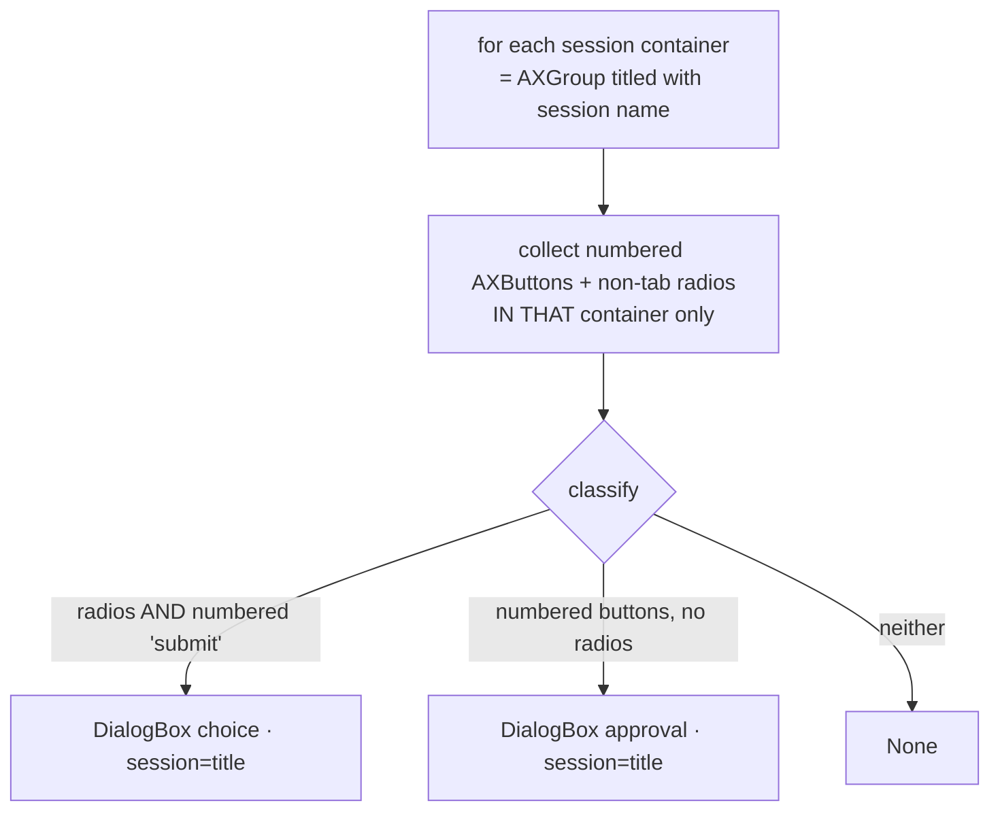

# Dialog state — sense Claude's approval/choice boxes as ground truth

Backlog idea (2026-07-07): treat a Claude Code prompt box as **another state, pegged
to the UI element** — the way `DICTATING` is pegged to the Voice-dictation button
(observe an event → re-read the element; never a timer). hey-claude should *know* when
Claude is waiting and give it a first-class state + voice grammar.

**Relationship to press-by-name.** [`PRESS-BY-NAME-PLAN.md`](PRESS-BY-NAME-PLAN.md)
already ships the *acting* half (`ax.press_by_name` `AXPress`es any button/radio by
label). **This plan is the *sensing* half** + the environment-awareness that makes it
correct. No new AXPress mechanics.

## Status & handover (2026-07-07)

**Design is COMPLETE; no code from this plan exists in `hey_claude/` yet.** Every AX
behaviour below was empirically probed on the live system — findings are inlined (see
§2, §6, and the §10 table) and are the **source of truth**. The probe scripts were
ephemeral scratch and were *not* committed; you do not need them (all results are in
this doc). All design decisions are settled.

**Where to start:** build in the §9 phase order, beginning at **Phase 0** — the pure
`appstate.py` FSM + its unit tests. §7 is the to-build module list. Mirror the repo's
existing patterns: FSM rigor (`LEGAL` + `_transition` chokepoint) in `hey_claude/state.py`;
the `_Observer` plumbing and retry loops in `hey_claude/ax.py`; protocols in
`hey_claude/ports.py`; test doubles in `tests/fakes.py`. Each phase must leave the tree
green (`.venv/bin/python -m pytest`) and the unit suite must stay pyobjc-free.

**One thing to re-verify live during Phase 1** (structurally proven, not yet demoed
end-to-end): per-session `classify` isolating two *simultaneous* boxes in split panes
(§6) — cheap to confirm with two split Claude sessions once `find_dialog` exists.

---

## 0. The scope decision (read first)

**Detection works only while VS Code is the stable foreground app, on the active tab.**
Proven: the Claude panel's webview a11y tree **collapses the instant another app takes
foreground** (`find_dialog → None`) and rebuilds only when VS Code is stably foreground
again — the box itself never closed. See §2.

We embrace this rather than fight it:

> **"Hey Jarvis" is the bridge.** Wake already raises VS Code (`bootstrap.raise_app`),
> which rebuilds the tree. So the away-case flow is: *you're in the browser → Claude
> needs approval (hey-claude is blind) → you say the wake word → VS Code comes forward →
> hey-claude now sees the box → announces it / you answer it.* The **only** user action
> needed from the background is the wake word.

This makes **VS Code foreground/background + tab state** first-class inputs — not
telemetry, but **correctness signals** (they disambiguate "resolved" from "can't see").

---

## 1. What we're modelling — two box types

Both render in a Claude session's panel webview, under the same stable ancestry. Both
use **numbered** action controls (`^\d+ ` in the a11y title) — a reliable "Claude action
control" marker (ordinary VS Code buttons like `Bypass permissions` are not numbered).
(A window shows one panel per tab-group, but split editors show several at once — §6
covers per-session scoping.)

### ① Approval box — terminal, single-press
```
AXButton  '1 Yes' · '2 Yes, allow <cmd> for all projects' · '3 No'
```
Numbered `AXButton`s, **no radios**. One `AXPress` resolves it.

### ② Choice box — select-then-submit
```
AXRadioButton 'Option A …' (AXValue 0→1) · … · 'Other'
AXButton      '1 Submit answers'  (AXEnabled=False → True once a radio is picked)
```
Radios **+** a numbered Submit. Radio `AXValue` = the pick; Submit `AXEnabled` = "ready".

**Discriminator:** radios present → choice; else numbered buttons → approval.

---

## 2. Empirical findings (all proven)

**Detection is event-driven** (not a poll). App-root `AXObserver`, fresh boxes of both
types:

| moment | notification | re-read truth |
|---|---|---|
| **appears** | `AXFocusedUIElementChanged` | `find_dialog()` → `DialogBox` |
| **resolves** | `AXFocusedUIElementChanged` | `find_dialog()` → `None` |
| **selection** (choice) | `AXValueChanged` | radio `AXValue`, Submit `AXEnabled` |

**Foreground-gated a11y (the #1 finding).** With a live box open and untouched:
```
BASELINE: choice(b1,r4) readable while VS Code stably foreground
… another app grabs foreground → box reads None for the entire 12s …
after VS Code restored to foreground → choice(b1,r4) identical (never closed)
```
⟹ **`find_dialog → None` is ambiguous: resolved OR backgrounded.** The foreground
signal is what tells them apart. Inactive tabs are likewise absent from the tree.

---

## 3. Environment state (new — correctness, not decoration)

Two very different shapes: **AppState is a first-class FSM**; **Tabs is a plain observed
snapshot** (no state machine — the open-tab set is dynamic and we can't drive internal
states for background tabs, only read their badge).



### 3a. `AppState` — a first-class FSM (`hey_claude/appstate.py`, pure)

Foreground/background is a **correctness gate** and is **orthogonal** to the turn phase
(you can be `ARMED` while foreground, or `IDLE` while background) — so it's a *separate*
small machine, **not** folded into `S`. Same rigor as `state.py`: `LEGAL` table, single
`_transition` chokepoint, logged transitions. The FSM logic is **pure** (unit-tested with
no pyobjc); an I/O observer in `system.py` feeds it events.



- **States:** `UNKNOWN` (boot, pre-observation) · `NOT_RUNNING` · `BACKGROUND` ·
  `FOREGROUND`.
- **Events (pure methods):** `on_activate` / `on_deactivate` / `on_launch` /
  `on_terminate`, called by the I/O observer.
- **Driven by** `NSWorkspace` `DidActivate/DidDeactivate/DidLaunch/DidTerminate` for the
  target bundle id — pure events, no poll.
- **What it gates:** on `→FOREGROUND`, attach `observe_dialog` + refresh `Tabs`; on
  `→BACKGROUND`/`→NOT_RUNNING`, detach + freeze dialog state (ignore the collapse-to-
  `None`); on `→FOREGROUND` after a new `DidLaunch`, re-attach to the new pid (fixes
  loophole #3). Transitions are logged so "went blind at T" is greppable.

### 3b. `Tabs` — an observed snapshot (no FSM)

Read the `AXTabGroup`'s `AXRadioButton` children **when foreground**: which tab is active
(`AXValue=1`), what tabs are open, and their **badges** (labels carry `… | N`, the
blue-dot "needs attention" count). Just data, refreshed on `AXSelectedChildrenChanged`
(tab switch) + on `→FOREGROUND`; **valid only while `FOREGROUND`**.

```python
@dataclass(frozen=True)
class Tab:
    title: str; active: bool; badge: int; is_claude: bool
# Tabs = tuple[Tab, ...]  — a snapshot, not a machine.
```

A **derived** per-tab status (`ACTIVE` / `BG_QUIET` / `BG_ATTENTION` when `badge>0`) is a
pure projection over the snapshot (a `classify`-style function), not authored
transitions — it powers Phase-4 "session X needs you."

`SystemPort` gains `list_tabs() -> tuple[Tab, ...]` + a focus-event callback hook;
`frontmost_bundle_id()` already exists. The `AppState` observer wraps the NSWorkspace
notifications.

---

## 4. Two detection paths



**Path B also fixes a current bug.** Today a pending dialog makes wake abort with
`Voice-dictation button not found` (the box covers the input). Inserting the
`find_dialog` check right after bootstrap turns that failure into the correct branch.

**Settle window (measured).** The webview tree rebuilds ~**560 ms** after `raise_app`
(§10 #10). So the Path-B check must **retry `find_dialog` for up to ~1.5 s** after the
raise before concluding "no dialog → dictate" — otherwise it reads a still-empty tree
and wrongly falls through. (Mirrors the existing `_focused_textarea`/`press_by_name`
retry loops.)

---

## 5. State machine

`S.DIALOG` is **reactive** (Claude-initiated). Detect only from `IDLE`; a box appearing
mid-`DICTATING` is rare → low-code mask (`on_dialog_change` ignored unless `IDLE`).



Key rules:
- **Foreground-gated resolve.** `on_dialog_change(None)` transitions `DIALOG→IDLE`
  **only if `AppState is FOREGROUND`.** If it just backgrounded, we suspend
  and hold `DIALOG` (or a `DIALOG(blind)` sub-flag) — never a false resolve.
- **Wake in `DIALOG` is allowed** (unlike `ARMED`/`DICTATING`): it re-raises VS Code and
  re-evaluates `find_dialog` — the "bring it back with Hey Jarvis" escape hatch, and the
  backstop against a missed resolve event wedging the daemon deaf.
- **Wake in `IDLE`** runs the Path-B `find_dialog` check after bootstrap before dictation.

### Detection sequence (Path A, foreground)



### Periodic reconciler — the backstop sweep (every N s)

Events are the sensor; **this is the safety net.** Event-driven detection drifts
*silently* whenever an event is dropped — a wedged `AXObserver`, a lost NSWorkspace
notification, a tree-rebuild race, or any unforeseen class. The doc patches *specific*
misses (wake-in-DIALOG refresh for #2, relaunch re-attach for #3) but has **no general
backstop**. Add a slow **reconciliation loop** (Kubernetes-style: *observed UI = desired,
in-memory state = actual, snap actual→desired on mismatch*). It does **not** replace
event detection — events keep ~ms latency; the reconciler only **bounds worst-case
staleness to N** and repairs drift no event will ever correct.

This is *not* the "never a timer" the doc warns against: that rule bans timers **as the
detection mechanism**. The reconciler never detects first — it only *reconciles* what
events already should have set. Defense-in-depth, not a poll.

Each tick, **only if `AppState is FOREGROUND`** (a background read is untrustworthy —
skipping the tick when blind is what keeps this from re-opening loophole #6):

1. **Ground the gate first.** Re-read `frontmost_bundle_id()`. If it disagrees with
   `AppState` (we believe `FOREGROUND` but VS Code isn't frontmost, or vice-versa), a
   `DidActivate`/`DidDeactivate` was missed → drive `AppState` through the legal
   transition before trusting anything downstream.
2. **Reconcile the dialog.** Re-read `find_dialog()` (per-session) and compare to what `S`
   believes:
   - believe `IDLE`, truth = box → **missed appear** → `on_dialog_change(box)`.
   - believe `DIALOG`, truth = `None` (persisted one beat) → **missed resolve** →
     `on_dialog_change(None)`. This is the *general* form of loophole #2 — it subsumes the
     wake-refresh backstop; wake stays the fast/explicit escape hatch, this is the passive
     one that fires even if you never speak.
   - believe `DIALOG(box A)`, truth = box B (different session/type) → correct the stash.
3. **Refresh Tabs.** Re-read `list_tabs()` and replace the snapshot wholesale (it's
   already a pure snapshot — a cheap overwrite; catches a missed
   `AXSelectedChildrenChanged` or badge change).



**Constraints (so it can't reintroduce a closed bug):**
- **Foreground-gated** — skip the whole tick unless `FOREGROUND` (else false-resolve, #6).
- **Through the chokepoints** — it calls `on_dialog_change` / the `AppState` transition
  methods, never a side door, so `LEGAL` + the anti-flicker "require `None` to persist"
  rule (§6, #5) still apply. The reconciler is pure I/O + comparison; it *drives* the FSMs,
  it doesn't mutate them.
- **Idempotent & slow** — `N ≈ 2–3 s`. When in-memory == truth (the overwhelming common
  case) the tick is a **no-op**; it only ever writes on genuine mismatch.
- **Logged as `reconcile:` transitions** — every correction is greppable
  (`reconcile: DIALOG→IDLE, missed resolve`). Frequency is itself a **health signal**: a
  reconciler that fires often means an observer is broken upstream.

Owned by `__main__.py` (same place that wires the observers), gated by `AppState`.
Config: `[dialog] reconcile_interval_s` (`0` = off).

---

## 6. Classification is pure (risky logic unit-testable)

`ax.py` (pyobjc) walks the active panel → raw `{role,label,enabled,selected}` dicts →
`dialog.classify(raw)` (pure) → `DialogBox`. Zero pyobjc in the policy.



```python
# hey_claude/dialog.py  (new, pure)
@dataclass(frozen=True)
class DialogBox:
    type: str                     # "approval" | "choice"
    session: str                  # owning session title (attribution — see scoping)
    options: tuple[str, ...]
    submit: str | None = None
    submit_enabled: bool = False
    selected: str | None = None

def classify(raw: list[dict]) -> DialogBox | None: ...   # pure; NUMBERED regex lives here
```

### Per-session isolation (scoping) — probed 2026-07-07

**Split editors expose BOTH panes' controls in the a11y tree at once** (verified: a box
in a non-focused split pane was read while the other pane was focused). A naive
whole-window walk therefore **merges** two panes' boxes into one misclassification. The
fix comes straight from the probed structure — both panes' ancestor chains are identical
down to a shared workbench `AXWebArea`, then **diverge at an `AXGroup` whose `AXTitle` is
the session name**:

```
AXWebArea 'workbench'  (shared; title = active editor — DON'T scope here, my first bug)
  … AXGroup(AXDocument)  (shared)
      AXGroup 'Create clickable icon…'   ← session A boundary  (left pane)
      AXGroup 'hi'                        ← session B boundary  (right pane, has the box)
```

So `find_dialog` works **per session container**, never whole-window:
1. Find each Claude session (each has a `Message input` `AXTextArea`).
2. **Session container = nearest ancestor `AXGroup` with a non-empty `AXTitle`** (= session
   name). Walk up from the input / from any control to hit it.
3. `classify()` each container's subtree **independently** → a `DialogBox` tagged with its
   `session`. No cross-pane merge — each box is attributed to its pane.
4. **Focused session** = the container of `AXFocusedUIElement`. `on_dialog_change` fires for
   the box in the focused session; a box in a *visible non-focused* pane is still detected
   (with attribution) and can be announced as "session X needs you."

This resolves loophole #4 (merge) for splits, tabs, and windows uniformly: the unit of
detection is the session container, not the window. (Separate OS windows are rare; tabs
show only the active one; splits show multiple — all handled by per-session scan.)

**Retry a few times** on first read (webview stale after render — mirrors
`press_by_name`) and require `None` to persist one beat before RESOLVE (anti-flicker,
loophole #5).

---

## 7. Module surface

| module | change |
|---|---|
| **`appstate.py`** (new, pure) | `AppState` enum + `AppStateMachine` (`LEGAL`, `_transition` chokepoint, `on_activate/deactivate/launch/terminate`, logged transitions). No pyobjc. |
| **`dialog.py`** (new, pure) | `DialogBox`, `classify(raw)`, `NUMBERED`. |
| **`ax.py`** | `find_dialog()` (**per-session-container** scan → raw per session → `classify`, attribute to focused session, with retry); `observe_dialog(cb)` (3rd `_Observer`, `AXFocusedUIElementChanged`, signature-debounced, **attached only while foreground**); `stop_observing_dialog()`; `list_tabs()`. |
| **`system.py`** | NSWorkspace activate/deactivate/launch/terminate observer → feeds `AppStateMachine`; `list_tabs()` from the `AXTabGroup`. |
| **`ports.py`** | `AXPort` += dialog methods + `list_tabs`; `SystemPort` += app-focus event callback. |
| **`state.py`** | `S.DIALOG`; `LEGAL`; `on_dialog_change(box|None)` **gated on `AppState is FOREGROUND`**; `_enter_dialog` (beep+stash+telemetry); wake-in-DIALOG refresh; Path-B `find_dialog` check in `on_wake` after bootstrap. Reads `AppStateMachine` (injected). |
| **`config.py`** | `[dialog]` (`enabled`, `announce_sound`, `reconcile_interval_s`). |
| **`__main__.py`** | build `AppStateMachine`; wire the NSWorkspace observer → it; on its `→FOREGROUND`/`→BACKGROUND` transitions attach/detach `observe_dialog` + refresh `Tabs`; `"dialog"` beep; own the **reconciler timer** (§5, foreground-gated re-read → drive FSMs via chokepoints). |
| **`telemetry.py`** | `log_dialog(event, box_type, n_options, foreground)`. |

---

## 8. Answering a box — the "escape + pre-fill" flow (SUPERSEDES press-by-name grammar)

**Revised 2026-07-07 (Phase 2 build).** The original plan assumed a spoken answer could be
captured *while the box is open* (press-by-name's premise: dictate `okay press yes` into the
input). **Live check: the mic disappears when a box covers the input** — Claude's Voice-dictation
button is gone, so there is no way to capture voice in place. So Phase 2 does NOT press the box's
buttons by voice. Instead a **wake while a box is open**:

1. **Esc** the box — which returns to the normal input **and** brings the mic back. (Esc declines
   the box, so the follow-up is a *fresh instruction*, not a second vote on the same tool call.)
2. **Pre-fill** the input with a compact reminder of the options we already captured from
   `classify()`: `[options were: 1 Yes · 2 Yes, allow all · 3 No] → `.
3. **Arm a normal dictation turn** — the spoken answer appends after the tag; `okay send` sends the
   whole thing to Claude with the question context intact.

This unifies the two entry points: the **observer** announces a foreground box (beep, `S.DIALOG`);
**any wake** while a box is present (whether we're in `S.DIALOG`, or Path-B finds one after a
background→foreground raise) runs the same Esc + pre-fill + dictate in one step. No STT, no tab
juggling, no new permission — it converts the blocked-box state back into the flow that already
works. Explicit approve-by-button (Yes/Allow) is deferred; you redirect by voice ("yes, do it").

**Choice boxes** ride the same flow — the pre-fill lists the radio options; you dictate your pick.

---

## 9. Phases (each ships green; pure tree unit-tested)

0. **Environment state** — `AppStateMachine` (pure FSM, unit-tested) + NSWorkspace
   observer + `list_tabs` snapshot. Small, isolated, independently useful (even without
   dialogs: "is VS Code up front?", "which session is active?").
1. **Sense + announce** — `dialog.classify` (+ tests), `find_dialog`/`observe_dialog`
   (foreground-gated), `S.DIALOG`, `_enter_dialog` beep, resolve→IDLE, Path-B wake check,
   wake-in-DIALOG refresh, **reconciler timer** (§5 backstop sweep), `[dialog]` config,
   `FakeAX`/`FakeSystem` support + state tests (incl. a fake-clock reconcile test:
   drop an event, tick, assert the FSM snaps to truth).
2. **Answer via escape + pre-fill** (§8, revised) — wake in a box → Esc + pre-fill options +
   normal dictation turn. Unifies Path-B (wake finds a box) with wake-in-DIALOG. *(shipped)*
3. **Answer choice** — `AXValueChanged` selection tracking + `option/submit` (gated).
4. **Background-tab awareness** — announce off the tab **badge** while VS Code foreground.

---

## 10. Loopholes & resolutions (from the design critique)

| # | issue | resolution | status |
|---|---|---|---|
| 1 | detection dies when VS Code backgrounded | **by design** — foreground-scoped + wake bridge (§0, §4) | ✅ verified |
| 6 | backgrounding looks like RESOLVE | **foreground-gated `on_dialog_change`** (§5) — the core correctness fix | ✅ verified |
| 8 | our-`AXPress` / mouse resolve fires no event | proven: `AXPress` resolve fires `AXFocusedUIElementChanged` ×2, `find_dialog→None +370ms` → `DIALOG→IDLE` auto-fires | ✅ verified |
| 9 | transcript-history phantom buttons | proven: answered prompts expose **no** numbered buttons/radios (25s scan, stayed 0) | ✅ verified |
| 10 | Path-B: `find_dialog` right after raise reads empty tree | **measured 560 ms** raise→readable → Path B retries `find_dialog` up to ~1.5 s after `raise_app` | ✅ verified |
| 2 | missed resolve → stuck `DIALOG` → deaf | **wake-in-DIALOG refresh** (explicit) **+ periodic reconciler** (§5, passive — fires without you speaking) | 🟡 build |
| 3 | observer dies on VS Code relaunch | `AppState` re-attaches the dialog observer on `DidLaunch`/`→FOREGROUND` (new pid); **reconciler** catches any tick where re-attach was missed | 🟡 build |
| 11 | **any** unforeseen dropped event → in-memory FSM/Tabs drift from UI truth | **periodic reconciler** (§5): foreground-gated re-read of `frontmost`/`find_dialog`/`list_tabs`, snap FSMs to truth via existing chokepoints; bounds staleness to N; fire-rate is a health signal | 🟡 build |
| 4 | whole-window walk → merge (splits expose **both** panes' controls!) | **per-session-container scan** (§6): classify each session's `AXGroup`-titled subtree independently, attribute each box to its session — no merge across panes/tabs/windows. Boundary probed & confirmed | ✅ verified (structure) |
| 5 | webview staleness → miss / flicker | **retry on read + require None to persist** before RESOLVE (§6) | 🟡 build |
| 7 | mid-`DICTATING` dialog | low-code mask (ignore unless `IDLE`) — accepted punt | 🟠 punted |
| 8k | keyboard resolve fires event | inferred low-risk — mouse-click **and** `AXPress` both fire it | 🟢 inferred |

All empirical unknowns are **closed** (probed 2026-07-07). Remaining 🟡 are standard
build-time mitigations verified in their phase; 🟠/🟢 are accepted.
